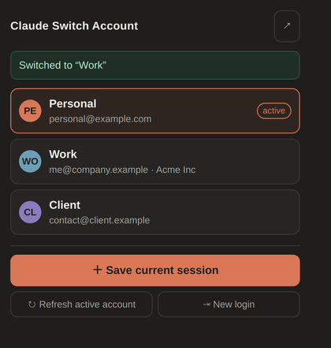

# Claude Switch Account

Extension navigateur (Manifest V3) pour garder **plusieurs comptes claude.ai** côte à côte et basculer de l'un à l'autre **en un clic** — sans se déconnecter puis se reconnecter à chaque fois.

[](https://github.com/Smeagolworms4/claude-switch-account/actions/workflows/build.yml)

[](https://www.buymeacoffee.com/smeagolworms4)
[](https://www.paypal.com/donate/?business=SURRPGEXF4YVU&no_recurring=0&item_name=Hello%2C+I%27m+SmeagolWorms4.+For+my+open+source+projects.%0AThanks+you+very+mutch+%21%21%21&currency_code=EUR)

**Français** · [English](README.md)

<p align="center">
  
</p>

---

## Fonctionnement

L'authentification claude.ai repose sur des cookies (`sessionKey` en tête). L'extension :

1. prend un **instantané** de tous les cookies `claude.ai` / `anthropic.com` dans un profil ;
2. récupère le **nom et l'e-mail** du compte via l'API claude.ai pour l'étiqueter automatiquement ;
3. à la bascule : resauvegarde la session courante (le `sessionKey` tourne), purge les cookies, réinjecte ceux du profil cible, puis recharge les onglets claude.ai ouverts.

Tout reste **en local** dans `chrome.storage.local`. Aucun serveur, aucune télémétrie, aucun mot de passe — uniquement les cookies que votre navigateur possède déjà.

## Installation

### Depuis une release

1. Téléchargez le `.zip` depuis [Releases](https://github.com/Smeagolworms4/claude-switch-account/releases) et décompressez-le.
2. Ouvrez `chrome://extensions` (ou `brave://extensions`, `edge://extensions`).
3. Activez le **mode développeur**.
4. **Charger l'extension non empaquetée** → sélectionnez le dossier décompressé.

### Depuis les sources

```bash
git clone https://github.com/Smeagolworms4/claude-switch-account.git
cd claude-switch-account
```

Puis chargez le dossier directement via **Charger l'extension non empaquetée**. Aucune étape de build : du JS natif, sans dépendance.

## Utilisation

| Action | Effet |
| --- | --- |
| **＋ Enregistrer la session actuelle** | Ajoute le compte connecté à la liste (nom + e-mail détectés automatiquement) |
| **Clic sur un compte** | Bascule dessus et recharge les onglets claude.ai |
| **⇥ Nouvelle connexion** | Vide la session sans supprimer les profils — pour ajouter un compte supplémentaire |
| **↻ Rafraîchir le compte actif** | Resauvegarde les cookies du compte actif (utile après une reconnexion) |
| **✎ / 🗑** | Renommer / supprimer un profil |

### Ajouter un deuxième compte

1. Connectez-vous au compte A sur claude.ai → **＋ Enregistrer la session actuelle**.
2. **⇥ Nouvelle connexion** → connectez-vous au compte B.
3. **＋ Enregistrer la session actuelle**.
4. Les deux comptes sont dans la liste ; un clic suffit pour basculer.

## Langues

Interface traduite via `chrome.i18n`, sélectionnée automatiquement selon la langue du navigateur :

🇬🇧 English (défaut) · 🇫🇷 Français · 🇩🇪 Deutsch · 🇪🇸 Español · 🇮🇹 Italiano · 🇵🇹 Português

Ajouter une langue = copier `_locales/en/messages.json` vers `_locales/<code>/messages.json`. La CI vérifie que toutes les langues portent exactement les mêmes clés.

## Développement

```
manifest.json          # MV3, permissions cookies/storage/tabs
background.js          # service worker : snapshot / purge / restauration des cookies
popup.html/.css/.js    # interface de la liste des comptes
_locales/<lang>/       # traductions
icons/                 # icônes générées
tools/build.sh         # produit dist/claude-switch-account-<version>.zip
tools/make-icons.py    # régénère les icônes (nécessite Pillow)
```

```bash
bash tools/build.sh          # empaqueter
python3 tools/make-icons.py  # régénérer les icônes
```

### CI

`.github/workflows/build.yml` s'exécute à chaque push, PR et tag :

- valide le manifest et la **parité des clés de traduction** entre toutes les langues ;
- vérifie la syntaxe JS (`node --check`) ;
- construit le zip et le publie en **artefact** téléchargeable ;
- sur un tag `v*` : aligne `manifest.version` sur le tag, crée la **release GitHub** avec le zip, puis publie sur le Chrome Web Store.

Publier une version :

```bash
git tag v1.0.1 && git push origin v1.0.1
```

La configuration initiale de la publication automatique est décrite dans [docs/PUBLISHING.md](docs/PUBLISHING.md).

## Sécurité & limites

- Les cookies de session sont stockés **en clair** dans le stockage local de l'extension — comme dans le jar de cookies du navigateur. Sur une machine partagée, supprimez les profils avant de partir.
- Un seul compte est actif **par profil navigateur** à un instant donné : c'est une bascule, pas du cloisonnement simultané (pour du simultané, utilisez les profils Chrome ou les conteneurs Firefox).
- Extension non officielle, sans lien avec Anthropic.
- Testée sur Chrome / Brave / Edge. Firefox nécessite une variante du manifest (`background.scripts`).

## Soutenir le projet

Si l'extension vous fait gagner du temps, un café est apprécié :

[](https://www.buymeacoffee.com/smeagolworms4)
[](https://www.paypal.com/donate/?business=SURRPGEXF4YVU&no_recurring=0&item_name=Hello%2C+I%27m+SmeagolWorms4.+For+my+open+source+projects.%0AThanks+you+very+mutch+%21%21%21&currency_code=EUR)

## Licence

MIT
